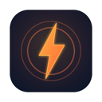

<div align="center">



# Dev Notifier

### A tiny macOS menu-bar app that watches Jira, GitHub & PagerDuty for things relevant to you and shows clickable desktop notifications

[](../../releases)
[](https://www.python.org/)

[Download](#download--install) · [Configure](#configuration) · [Tutorial](TUTORIAL.md) · [Build from source](#build-from-source)

</div>

---

Dev Notifier lives in your menu bar and polls, every few minutes:

- **Jira** — issues where you are the assignee, reporter, or watcher that were
  recently updated, plus comments mentioning you.
- **GitHub** — review requests, mentions, assignments, and activity on your own
  PRs (via the `gh` CLI notifications API).
- **GitHub CI (fallback)** — the CI rollup of your open PRs, so you get pinged
  on ❌ failures / ⏳ pending even if notification settings suppress them.
- **PagerDuty** — incidents assigned to you (triggered/acknowledged) and your
  teams' incidents changed recently, so acknowledge / resolve / escalate status
  changes resurface (via the PagerDuty REST API).

When something new shows up it raises a **native macOS notification**, and
**clicking the notification opens the Jira issue / PR / incident in your
browser**.

Because it's a properly bundled `.app` with its own bundle identifier, macOS
grants it real notification permission — unlike ad-hoc `osascript`/CLI
notifications, its click action actually works.

## Download & Install

1. Grab the latest `DevNotifier-<version>.dmg` from
   [Releases](../../releases).
2. Open the DMG and drag **DevNotifier.app** to Applications.
3. This is an unsigned open-source build, so the first launch needs:
   **right-click DevNotifier → Open → Open**. (If it says "is damaged", run
   `xattr -dr com.apple.quarantine /Applications/DevNotifier.app`.)
4. Allow notifications when prompted.

## Configuration

On first launch a config file is created at:

```
~/.config/dev-notifier/config.json
```

Open it (menu-bar icon → **Open config file**) and fill in your details:

```json
{
  "jira": {
    "enabled": true,
    "base_url": "https://your-domain.atlassian.net",
    "username": "you@example.com",
    "api_token": "<your Jira API token>"
  },
  "github": {
    "enabled": true,
    "login": ""
  },
  "pagerduty": {
    "enabled": false,
    "api_token": "",
    "user_id": "",
    "team_ids": []
  },
  "poll": {
    "interval_seconds": 300,
    "window_minutes": 10
  }
}
```

- **Jira token:** create one at
  <https://id.atlassian.com/manage-profile/security/api-tokens>.
- **GitHub:** no token needed — it uses the [`gh` CLI](https://cli.github.com).
  Run `gh auth login` once. Leave `login` blank to auto-detect.
- **PagerDuty:** set `enabled` to `true` and paste a **User API token**
  (PagerDuty → *My Profile → User Settings → API Access → Create API User
  Token*). Leave `user_id` and `team_ids` blank to auto-detect the current user
  and their teams via `/users/me`.
- **poll:** `interval_seconds` how often to check, `window_minutes` how far
  back each check looks.

The config file stays on your machine and is never committed.

## Menu

- **Check now** — poll immediately (manual pull).
- **Status:** — shows whether Jira / GitHub / PagerDuty are ready; click to re-check.
- **Recent:** — the last items seen; hover → **Open** / **Remove**.
- **Clear all recent** — empty the list.
- **Theme ▸** — switch the menu-bar icon color.
- **Start at login** — toggle auto-start (installs/removes a LaunchAgent).
- **Check dependencies** — re-run the gh / Jira / PagerDuty checks.
- **Open config file** — edit your settings.
- **Quit**.

### Dependency checks

On startup the app verifies the `gh` CLI (installed + logged in), your Jira
config, and your PagerDuty token, showing the result in the **Status:** line and
guiding you if something is missing. You can also run the standalone doctor:

```bash
bash scripts/doctor.sh
```

### Start at login

Enable **Start at login** to auto-launch on login. It writes a per-user
LaunchAgent to `~/Library/LaunchAgents/ai.stevezou.devnotifier.plist`; toggling
it off removes that file. Nothing is installed system-wide.

See the full [Tutorial](TUTORIAL.md) for setup, troubleshooting, and uninstall.

## Build from source

Requires Python 3.12+ and (for packaging) `create-dmg` (`brew install create-dmg`).

```bash
python3 -m venv venv && source venv/bin/activate
pip install -r requirements-build.txt

# Run directly:
python launcher.py

# Or build the .app + .dmg:
python scripts/generate_icon.py
APP_VERSION=1.0.0 pyinstaller packaging/dev-notifier.spec --noconfirm
APP_VERSION=1.0.0 bash packaging/macos_package.sh
# -> dist/DevNotifier-1.0.0.dmg
```

## Releasing

Push a tag and GitHub Actions builds and publishes the DMG:

```bash
git tag v1.0.0 && git push origin v1.0.0
```

## License

MIT
