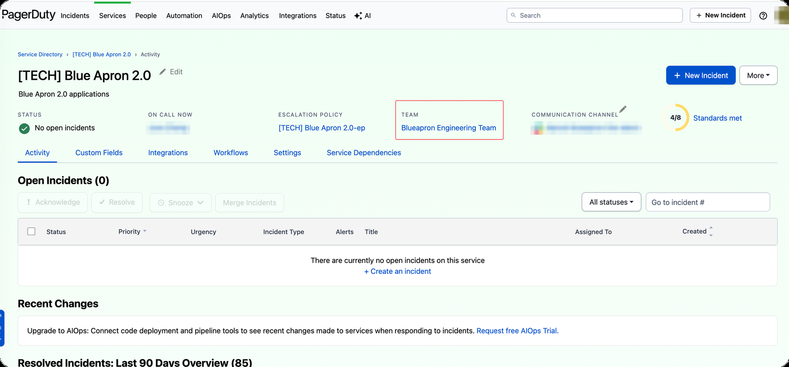

# Dev Notifier — Tutorial

**Dev Notifier** is a little app that sits in your menu bar (macOS) or system
tray (Windows) and quietly watches **Jira**, **GitHub**, and **PagerDuty** for
things that concern you. When something new shows up, it pops a desktop
notification — and clicking it opens the issue / pull request / incident in your
browser.

You don't need to be a developer to use it. This guide starts with the
**5‑minute quick start**; the later sections are only there if you want them.

- New to it? Read **[Quick start](#quick-start)**.
- Want GitHub or PagerDuty too? See **[Add more sources](#add-more-sources-optional)**.
- Something not working? See **[Troubleshooting](#troubleshooting)**.
- Command‑line lover / power user? See **[Advanced](#advanced-optional)**.

---

## Quick start

Get Jira notifications working in about 5 minutes — all by clicking, no
command line needed.

### Step 1 — Install the app

**macOS** *(Apple Silicon)*
1. Download the latest **`DevNotifier‑<version>.dmg`** from
   [Releases](../../releases).
2. Open it and drag **DevNotifier** into your **Applications** folder. (Don't
   just double‑click it inside the DMG window — run the copy in Applications.)
3. The first launch is blocked by macOS: you'll see *"DevNotifier is damaged
   and can't be opened"* or *"cannot be opened because the developer cannot be
   verified"*. *(This build is free and open‑source, so it isn't signed with a
   paid Apple certificate — that's why macOS complains. It's safe.)* Fix it
   once by opening **Terminal** (⌘‑Space, type `Terminal`) and pasting:
   ```bash
   xattr -dr com.apple.quarantine /Applications/DevNotifier.app
   ```
   Then double‑click DevNotifier in Applications. *(Alternative without the
   terminal: after the warning, go to **System Settings → Privacy & Security**
   and click **Open Anyway**. On macOS 14 and earlier, right‑click → **Open** →
   **Open** also works.)*
4. The very first launch can take 10–20 seconds while macOS scans the app —
   wait for the icon rather than double‑clicking again.
5. If it asks to send notifications, click **Allow**. (This prompt appears
   only once; if you miss it, see [Troubleshooting](#troubleshooting).)

**Windows**
1. Download the latest **`DevNotifier‑<version>‑setup.exe`** from
   [Releases](../../releases).
2. Double‑click it and click through the installer (no admin rights needed).
   If Windows shows *"Windows protected your PC"*, click **More info** →
   **Run anyway**.
   *(Same reason as above — it's an unsigned open‑source build, not a virus.)*
3. Leave **"Start Dev Notifier when I sign in"** ticked if you want it to run
   automatically. If it asks to send notifications, click **Allow**.

A small **lightning‑bolt icon** now appears — in the menu bar (macOS, top‑right)
or the system tray (Windows, bottom‑right; click the ▲ arrow if it's hidden).

### Step 2 — Get a Jira token (30 seconds)

1. Open <https://id.atlassian.com/manage-profile/security/api-tokens> in your
   browser.
2. Click **Create API token**, give it a name like `dev-notifier`, and click
   **Create**.
3. **Copy** the token (you'll paste it in the next step).

### Step 3 — Enter your Jira details

1. Click the lightning‑bolt icon → **Open config file**. A text file opens.
2. Fill in three things under `"jira"`:
   - `base_url` — your Jira address, e.g. `https://acme.atlassian.net`
   - `username` — your Atlassian login email
   - `api_token` — paste the token from Step 2
3. **Save** the file.

> The file has short notes next to each field to guide you. Only change the
> values inside the quotes; keep the quotes and commas as they are.

### Step 4 — Confirm it's working

Click the icon → **Check dependencies**. This re‑reads the file you just saved
and the **Status** menu should show **Jira: ✓ Ready**. Then click **Check now**
to run a real check: if the token or address is wrong, Status will show the
error next to Jira (e.g. *HTTP 401 unauthorized*) and a ⚠ appears beside the
icon. If it says *Checked — no new items*, everything works — you'll now get a
notification whenever a relevant Jira issue changes, and clicking it opens the
issue.

GitHub is off by default. To add it, see
[Add more sources → GitHub](#github).

---

## What you'll get notified about

- **Jira** — issues where you're the assignee, reporter, or watcher that were
  updated, plus comments that mention you.
- **GitHub** *(optional)* — review requests, mentions, assignments, and activity
  on your own pull requests. Plus a heads‑up when your PR's checks **fail** or
  are **pending**.
- **PagerDuty** *(optional)* — incidents assigned to you or your teams: when
  they're triggered, acknowledged, escalated or reassigned **to you**, resolved,
  get a note, change priority, or someone requests you as a responder — each
  notification says who did it. You also get on‑call shift reminders (a day and
  an hour before, at the start, and at the end), and the menu shows whether
  you're on‑call right now and your open incidents.

Click any notification (or its **Open** button) to open it in your browser.
You can also reopen recent items from the **Recent** menu.

If a lot happens at once (first launch, back from a weekend), you get **one
summary notification** ("12 new updates — see Recent") instead of a dozen
pop‑ups; the individual items are all in **Recent**.

---

## Using the menu

Click (macOS) or right‑click (Windows) the icon:

| Item | What it does |
|------|--------------|
| **Check now** | Check right away instead of waiting for the timer. Tells you if a source failed |
| **Status ▸** | When the last check ran, and whether Jira / GitHub / PagerDuty are working. A failing source shows its error here (and a ⚠ badge appears next to the icon). Also **Re‑check now** and **View log** |
| **PagerDuty ▸** | *(when enabled)* Every escalation level you're currently on — **On‑call now** (level 1), **Backup on‑call (level 2)**, **Fallback on‑call (level 3+)** — each opens its schedule / escalation policy in PagerDuty; your next shift; and your open incidents — click one to open it |
| **Pause notifications ▸** | Mute pop‑ups for 1 hour / 4 hours / until you resume. Items still go to Recent; a ⏸ badge shows while paused |
| **Recent** | The last items seen — reopen or remove them |
| **Clear all recent** | Empty the recent list |
| **Check for updates** / **Update available: x.y.z ▸** | Check GitHub Releases; when a newer version exists: **Download update…** (macOS) / **Download & Install** (Windows), **Release notes**, **Skip this version**. See [Updating](#updating) |
| **Theme** | Change the icon color |
| **Start at login** | Launch automatically when you sign in |
| **Check dependencies** | Reload the config file and re‑check your setup; reports any problems |
| **Open config file** | Edit your settings |
| **Quit** | Exit the app |

---

## Add more sources (optional)

### GitHub

GitHub uses the free **GitHub CLI** (`gh`) so no token is stored in the app.
This step does need a terminal once.

1. Install the GitHub CLI:
   - **macOS:** `brew install gh`
   - **Windows:** `winget install --id GitHub.cli` (or download from
     <https://cli.github.com>), then open a **new** terminal window.
2. Sign in once: run `gh auth login`, choose **GitHub.com → HTTPS**, and finish
   in the browser.
3. In the config file set `"enabled": true` under `"github"` and save.
4. Back in Dev Notifier, click **Check dependencies** — GitHub should show ✓.

### PagerDuty

Dev Notifier needs a **personal User API Token** — a key tied to *your* user,
so it can ask PagerDuty "which incidents are assigned to *me*, when am *I*
on‑call". Any PagerDuty user can create one; no admin rights needed.

> Don't use a **General Access REST API key** (the ones under *Integrations →
> Developer Tools → API Access Keys*, `https://<your-subdomain>.pagerduty.com/api_keys`).
> Those are account‑wide, need an Admin to create, and have no notion of "me",
> so the app cannot tell which incidents or shifts are yours.

**Step 1 — Open your User Settings**

1. Sign in to PagerDuty in your browser. Note the address: it looks like
   `https://<your-subdomain>.pagerduty.com/…` (e.g. `acme.pagerduty.com`).
2. Click your **avatar** (top‑right) → **My Profile**. The address becomes
   `https://<your-subdomain>.pagerduty.com/users/<YOUR-USER-ID>` — the ID is a
   short code starting with `P`, e.g. `PABC123`.
3. Click the **User Settings** tab. Direct link, once you know both values:

   ```
   https://<your-subdomain>.pagerduty.com/users/<YOUR-USER-ID>/settings
   ```
   → **User Settings** tab → scroll to **API Access**.

   Official guide: <https://support.pagerduty.com/main/docs/api-access-keys#generate-a-user-token-rest-api-key>

**Step 2 — Create the token**

1. Under **API Access**, click **Create API User Token** (labelled
   **Create API User Key** in newer UIs).
2. Enter a **Description** such as `dev-notifier` (so you can recognise — and
   later revoke — it), then click **Create Key**.
3. **Copy the 20‑character key now.** PagerDuty shows it only once; if you lose
   it, delete it and create a new one. Click **Close**.

The page looks like this — the **User Settings** tab, the **API Access**
section with the create button, and your user ID in the address bar are all
outlined in red:


**Step 3 — Put it in Dev Notifier**

1. Click the lightning‑bolt icon → **Open config file**.
2. Under `"pagerduty"`, set `"enabled": true` and paste the key into
   `"api_token"`:
   ```json
   "pagerduty": {
     "enabled": true,
     "api_token": "u+AbCdEfGhIjKlMnOpQr"
   }
   ```
3. **Save** the file, then click **Check dependencies** — the Status menu
   should show **PagerDuty: ✓ Ready**.
4. Click **Check now**. If the key is wrong or was revoked, Status shows
   `PagerDuty: ⚠ HTTP 401 unauthorized` and a ⚠ appears next to the icon;
   otherwise **PagerDuty ▸** fills in with your on‑call state.

Your teams and user ID are detected automatically from the token. You'll be
notified about incidents on your teams and anything assigned to you, and get a
heads‑up **1 day** and **1 hour** before each on‑call shift (plus when it starts
and ends). Low‑urgency incidents notify silently. To change any of this, see the
`pagerduty.*` rows under [Advanced config fields](#advanced-config-fields).

**Optional — pin your user ID and team(s)**

Auto‑detection uses every team you're a member of. If you belong to several
teams but only want incidents from one, or your PagerDuty user isn't on the
team whose incidents you care about, set `user_id` and `team_ids` explicitly.
Both are short codes starting with `P` and can be read straight from the
address bar:

- **User ID** — the code in the URL of your profile from Step 1:
  `https://<your-subdomain>.pagerduty.com/users/`**`PXXXXXX`**`/settings`.
- **Team ID** — open **Services**, click the service you want to watch, and
  click the link under **TEAM**:

  

  The team page's URL contains the team ID:
  `https://<your-subdomain>.pagerduty.com/teams/`**`PXXXXXX`**`/schedules`.
  (The **Schedules** tab also shows the on‑call rotations the app will report.)

  

Then add them next to the token:

```json
"pagerduty": {
  "enabled": true,
  "api_token": "u+AbCdEfGhIjKlMnOpQr",
  "user_id": "PXXXXXX",
  "team_ids": ["PYYYYYY"]
}
```

`team_ids` is a list, so you can name more than one team. Leave either field
out (or empty) to keep auto‑detecting it.

> **EU accounts** (`https://<subdomain>.eu.pagerduty.com`) are not supported
> yet — the app talks to the US API host. Status will show
> `PagerDuty: ⚠ HTTP 401` for an EU token.

To revoke the token later: same **User Settings → API Access** page →
**Remove** next to `dev-notifier`.

---

## Start at login

Click the icon → **Start at login** to have Dev Notifier launch automatically
when you sign in. Click it again to turn it off. Nothing is installed
system‑wide, and it only affects your own user account.

- **macOS** may show a one‑time *"Background Items Added"* notice — that's the
  login entry being registered. Turn it on only after the app is in
  **Applications** (the app refuses while running from the DMG, because that
  location disappears when you eject the disk image). If you later move the
  app, the entry is repaired automatically the next time you launch it.
- **Windows** ticks the box for you if you left *"Start Dev Notifier when I
  sign in"* on in the installer.

---

## Updating

Dev Notifier checks GitHub Releases once a day (and via **Check for updates**).
When a newer version exists the menu shows **Update available: x.y.z ▸** and a
notification appears.

- **macOS** — **Download update…** downloads the DMG, verifies its SHA‑256
  against the release's `SHA256SUMS.txt` (the download is discarded if it can't
  be verified) and opens it. Then: **Quit** Dev Notifier, drag the new app into
  **Applications** and choose **Replace**, and launch it again. Because the
  build is unsigned you will likely see the *"is damaged"* message again — run
  the same `xattr -dr com.apple.quarantine /Applications/DevNotifier.app` line
  from Step 1.
- **Windows** — **Download & Install** downloads and verifies the installer and
  launches it; the installer closes the running app, replaces it, and starts
  the new version.
- **Skip this version** hides that release until the next one.

---

## Troubleshooting

**No notifications appear**
- Check the menu: is **Pause notifications** active (a ⏸ next to the icon)?
  Click **Resume notifications**.
- Open **Status ▸**. If it shows a ⚠ next to a source, that source is failing
  (wrong token, network, VPN) — the line tells you why. If **Last check** is
  old or *not yet*, the app isn't polling; try **Check now**.
- **macOS:** System Settings → Notifications → **DevNotifier** → *Allow
  Notifications*. The "Allow?" prompt only appears once — if you dismissed it,
  this is where to turn it on. Choose the **Alerts** style if you want
  notifications to stay on screen until clicked (Banners disappear after a few
  seconds). If you use a **Focus** mode, add DevNotifier to its *Allowed
  Apps*.
- **Windows:** Settings → System → **Notifications** → turn on *Dev Notifier*.
  Turn off Focus assist / Do not disturb, or add Dev Notifier to its priority
  list.

**Status shows "⚠ HTTP 401 / 403" next to Jira or PagerDuty**
- The token (or, for Jira, the email) is wrong or was revoked. Create a new
  token, paste it into the config file, save, and click **Check dependencies**
  → **Check now**.

**Status shows "⚠ timed out" / "network error" / "TLS certificate verification failed"**
- The app couldn't reach the service: check your network or VPN. Nothing is
  lost — updates from the failed window are fetched on the next successful
  check. *TLS certificate verification failed* usually means a corporate proxy
  that inspects HTTPS; GitHub (via `gh`) keeps working, Jira/PagerDuty may not.

**Status shows Jira isn't ready**
- Open the config file and make sure `base_url`, `username`, and `api_token`
  are your real values (not the `your-domain` / `you@example.com` placeholders),
  then **Save** and click **Check dependencies**.
- If you see a note in the log about "could not read config", the file has a
  small typo (often a missing comma or quote). Your file is kept as‑is so you
  can fix it — see [View the log](#view-the-log).

**Status shows GitHub isn't ready**
- The `gh` tool isn't installed or you're not signed in. Follow
  [GitHub](#github) above, then click **Check dependencies**.

**Status shows "PagerDuty: Needs token"**
- You turned PagerDuty on but didn't paste a token. Create one (step‑by‑step
  in [PagerDuty](#pagerduty)) or set `"enabled": false` to turn it back off.

**Status shows "PagerDuty: ⚠ HTTP 401" although I pasted a token**
- The token was revoked, mistyped, or is a *General Access* key instead of a
  personal *User Token* — or your account is on the EU region
  (`*.eu.pagerduty.com`, not yet supported). Create a **User Token** under
  your avatar → **My Profile → User Settings → API Access** (see
  [PagerDuty](#pagerduty)), paste it, save, **Check dependencies**, **Check
  now**.

**PagerDuty menu says I'm on‑call but PagerDuty shows someone else**
- Open **PagerDuty ▸**: each line is one escalation level you sit on.
  *On‑call now* is level 1 (what PagerDuty's service page shows as *On call
  now*); *Backup on‑call (level 2)* and *Fallback on‑call (level N)* mean you
  are only paged if the people before you don't acknowledge. Click a line to
  open that schedule / escalation policy in PagerDuty and check. *direct policy
  target, no end* means you're listed on the policy itself rather than via a
  rotation. Only level 1 makes the header say **on‑call** (and triggers shift
  reminders); raise `"oncall_max_level"` if you want level 2+ to count too.

**Too many PagerDuty notifications**
- Add `"notify_team_incidents": false` under `"pagerduty"` to only hear about
  incidents assigned to you (and escalations / responder requests aimed at you).
- Add `"oncall_reminders": false` to turn off shift reminders, or shorten
  `"oncall_remind_before_minutes"` (e.g. `[60]` for just a one‑hour heads‑up).

**Clicking a notification doesn't open anything**
- Click the notification's **Open** button (on macOS, hover over the banner to
  reveal it) rather than dismissing it. Make sure you allowed notifications the
  first time. On Windows, also make sure you have a default web browser set.

**"Start at login" is on but the app doesn't start**
- The app was moved after you turned it on, or you turned it on while running
  from the DMG. Launch the app from **Applications** once (it repairs the
  entry), or toggle **Start at login** off and on again.

**Two icons / duplicate notifications**
- Two copies are running (e.g. one from the DMG and one from Applications).
  Quit both, eject the DMG, and launch only the copy in Applications.

**The config file has a typo**
- The **Status** menu shows *Config: ⚠ …* with the problem (e.g. an unknown
  setting name or a value of the wrong type), and a note is written to the log.
  Your file is never overwritten while it can't be read — fix the typo, save,
  and click **Check dependencies**.

**macOS says the app "is damaged"**
- This is the unsigned‑build warning. Run the one‑line fix from Step 1 (also
  under [Advanced](#advanced-optional)). You'll need it again after updates.

---

## Advanced (optional)

Everything below is for power users. A typical user never needs it.

### Run from source

Requires Python 3.9 or newer. Platform dependencies are picked automatically.

**macOS**
```bash
git clone https://github.com/SteveZouWonder/dev-notifier.git
cd dev-notifier
python3 -m venv venv && source venv/bin/activate
pip install -r requirements.txt
python launcher.py
```

**Windows (PowerShell)**
```powershell
git clone https://github.com/SteveZouWonder/dev-notifier.git
cd dev-notifier
python -m venv venv; .\venv\Scripts\Activate.ps1
pip install -r requirements.txt
python launcher.py
```

### Where files live

```
Config   macOS:   ~/.config/dev-notifier/config.json
         Windows: %APPDATA%\dev-notifier\config.json
State    macOS:   ~/.config/dev-notifier/state.json      (seen items, Recent, pause)
         Windows: %APPDATA%\dev-notifier\state.json
Log      macOS:   ~/.config/dev-notifier/notifier.log    (also: Status ▸ View log)
         Windows: %APPDATA%\dev-notifier\notifier.log
Updates  macOS:   ~/Library/Caches/dev-notifier/          (downloaded installers)
         Windows: %LOCALAPPDATA%\dev-notifier\
```

The config file holds your API tokens in plain text; it is created readable by
your user only. The log records the title of every notification (issue
summaries, PR titles, incident names) — keep that in mind before sharing it.

### Advanced config fields

The first‑run file only shows the common settings. You can add any of these by
hand; each has a sensible built‑in default, so you only need them to change
behaviour:

| Field | Default | Meaning |
|-------|---------|---------|
| `poll.interval_seconds` | `300` | How often to check (seconds, minimum 30). Takes effect on the next **Check dependencies** / poll — no restart needed |
| `poll.window_minutes` | `1440` | How far back the first check looks |
| `poll.max_window_minutes` | `10080` | Cap on the look‑back window (7 days) |
| `jira.event_mode` | `true` | One notification per change/comment vs. per issue |
| `jira.event_fields` | `["status","assignee"]` | Which Jira field changes notify you |
| `github.login` | `""` | Leave blank to auto‑detect via `gh api user` |
| `jira.suppress_self` / `github.suppress_self` / `pagerduty.suppress_self` | `true` | Hide things you did yourself (your own comments, acks, resolves, pushes to your own PR, GitHub Actions runs you triggered…) |
| `jira.suppress_automation` | `true` | Hide changes made by apps/automation rules (e.g. "Automation for Jira" moving a ticket after you opened a PR) — unless they assign the issue to you |
| `github.ci_notify` | `["fail"]` | Which CI roll‑up states on your own open PRs pop up a notification (`fail`, `pending`, `pass`); the others are remembered silently. `[]` turns CI notifications off |
| `github.emails` | `[]` | Extra git author emails that count as *you* when GitHub cannot link a commit to your account (e.g. a mistyped `git config user.email`). Your profile's public email is picked up automatically |
| `pagerduty.user_id` / `team_ids` | auto | Leave blank to auto‑detect from the token. Set them to restrict incidents to specific teams — see [PagerDuty → Optional](#pagerduty) for where to find the IDs |
| `pagerduty.notify_team_incidents` | `true` | Also notify about your teams' incidents, not just ones assigned to you |
| `pagerduty.low_urgency_sound` | `false` | Play a sound for low‑urgency incidents too (they're silent by default) |
| `pagerduty.oncall_reminders` | `true` | Notify before / at the start / at the end of your on‑call shifts |
| `pagerduty.oncall_remind_before_minutes` | `[1440, 60]` | How long before a shift to send a heads‑up (minutes; one per entry) |
| `pagerduty.oncall_max_level` | `1` | Deepest escalation level that counts as "on‑call" (header, Status line, shift reminders). All levels are always *listed* in PagerDuty ▸ with their own wording; by default only level 1 — what PagerDuty's own *On call now* shows — counts. Set `2` or `3` to also get reminders when you're the backup/fallback |
| `update.enabled` | `true` | Auto‑check GitHub Releases for a newer version |
| `update.check_interval_hours` | `24` | How often to check for a newer version (hours) |
| `update.skipped_version` | `""` | App‑managed. Set by **Skip this version**; normally you don't edit it |
| `theme` | `"Orange"` | `Orange \| Green \| Purple \| Rainbow \| Yellow` |

### Full config.json reference

The first‑run file is intentionally minimal. If you want to see **every**
setting in one place, the file below shows all fields at their built‑in
defaults. You never need to write it out in full — any field you omit falls back
to these values — but it's a handy reference for advanced tuning. (JSON has no
comments, so the meaning of each field is in the table above.)

```json
{
  "jira": {
    "enabled": true,
    "base_url": "https://your-domain.atlassian.net",
    "username": "you@example.com",
    "api_token": "",
    "event_mode": true,
    "event_fields": ["status", "assignee"],
    "suppress_self": true,
    "suppress_automation": true
  },
  "github": {
    "enabled": true,
    "login": "",
    "suppress_self": true,
    "ci_notify": ["fail"],
    "emails": []
  },
  "pagerduty": {
    "enabled": false,
    "api_token": "",
    "user_id": "",
    "team_ids": [],
    "suppress_self": true,
    "notify_team_incidents": true,
    "low_urgency_sound": false,
    "oncall_reminders": true,
    "oncall_remind_before_minutes": [1440, 60],
    "oncall_max_level": 1
  },
  "poll": {
    "interval_seconds": 300,
    "window_minutes": 1440,
    "max_window_minutes": 10080
  },
  "update": {
    "enabled": true,
    "check_interval_hours": 24,
    "skipped_version": ""
  },
  "theme": "Orange"
}
```

### View the log

```bash
# macOS
tail -f ~/.config/dev-notifier/notifier.log
```
```powershell
# Windows (PowerShell)
Get-Content -Wait "$env:APPDATA\dev-notifier\notifier.log"
```

### Start‑at‑login internals

- **macOS** — a LaunchAgent at
  `~/Library/LaunchAgents/ai.stevezou.devnotifier.plist`.
- **Windows** — a value named `DevNotifier` under
  `HKCU\Software\Microsoft\Windows\CurrentVersion\Run`.

### macOS "is damaged" fix

```bash
xattr -dr com.apple.quarantine /Applications/DevNotifier.app
```

### Uninstall

**macOS**
1. Turn off **Start at login** first (while the app is still installed), then
   **Quit** from the menu.
2. Delete `/Applications/DevNotifier.app`.
3. If you deleted the app before turning off Start at login, remove the
   leftover login entry by hand:
   ```bash
   launchctl unload ~/Library/LaunchAgents/ai.stevezou.devnotifier.plist 2>/dev/null
   rm -f ~/Library/LaunchAgents/ai.stevezou.devnotifier.plist
   ```
4. Optionally remove your data (config with tokens, state, log, cached
   downloads):
   ```bash
   rm -rf ~/.config/dev-notifier ~/Library/Caches/dev-notifier
   ```
   The notification permission entry disappears from System Settings on its
   own after a restart.

**Windows**
1. Turn off **Start at login**, then **Quit** from the tray menu.
2. **Installed with the setup .exe:** Settings → Apps → **Dev Notifier** →
   **Uninstall** (or use the uninstaller in the Start Menu folder).
   **Portable .exe:** just delete the `DevNotifier-<version>-portable.exe`
   file.
3. Optionally remove your data:
   ```powershell
   Remove-Item -Recurse -Force "$env:APPDATA\dev-notifier", "$env:LOCALAPPDATA\dev-notifier"
   ```
   If you deleted the exe before turning off Start at login, also remove the
   stale entry: `reg delete HKCU\Software\Microsoft\Windows\CurrentVersion\Run /v DevNotifier /f`
